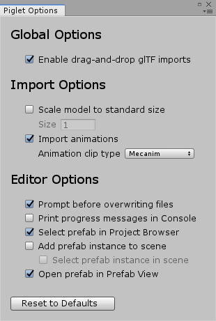

-   Online documentation:
    <https://awesomesaucelabs.github.io/piglet-manual/>
-   Support e-mail: "awesomesaucelabs" (at gmail)

{width="40%"}

# Table of Contents

* [Introduction](#introduction)
* [Features](#features)
* [Caveats](#caveats)
* [Setup](#setup)
* [Editor Imports](#editor-imports)
    * [Importing glTF Files by Drag-and-Drop](#importing-gltf-files-by-drag-and-drop)
    * [Editor Animation Tutorial](#editor-animation-tutorial)
        * [Previewing Animations in the Editor](#previewing-animations-in-the-editor)
        * [Playing (Mecanim) Animations at Runtime](#playing-mecanim-animations-at-runtime)
    * [Piglet Options Window](#piglet-options-window)
* [Runtime Imports](#runtime-imports)
    * [Runtime Import Tutorial](#runtime-import-tutorial)
    * [Runtime Animation Tutorial](#runtime-animation-tutorial)
    * [Runtime Import API](#runtime-import-api)
        * [Overview](#overview)
        * [Creating a GltfImportTask](#creating-a-gltfimporttask)
        * [Configuring Callbacks on a GltfImportTask](#configuring-callbacks-on-a-gltfimporttask)
        * [Executing a GltfImportTask](#executing-a-gltfimporttask)
* [URP Support (Unity 2019.3+)](#urp-support)
* [Sample Application: PigletViewer](#piglet-viewer)
* [Changelog](#changelog)
* [Footnotes](#footnotes)

# Introduction

Piglet is a Unity asset that allows you to import 3D models from glTF
files, both in the Editor and at runtime. This provides Unity developers
with access to a large collection of free textures, materials, and models
from sites like [Sketchfab](https://sketchfab.com/) and [Google
Poly](https://poly.google.com)[^poly].

Visit the [Web
Demo](https://awesomesaucelabs.github.io/piglet-webgl-demo/)[^web-demo]
to try Piglet before you buy it.

# Features

* import glTF models in the Editor or at runtime
* import glTF models from `.gltf`, `.glb`, or `.zip` files, using file
  paths or HTTP URLs
* supports animations, including skins and blendshapes
* extract textures and materials from glTF files to use with your own models
* tested with glTF models from [Sketchfab](https://sketchfab.com/),
  [Google Poly](https://poly.google.com), and
  [Blender](https://www.blender.org/)
* supported platforms: Windows, Android, WebGL (Unity 2018.4 or newer)
* supported render pipelines: built-in (Unity 2018.4+), URP (Unity 2019.3+)
* full source code provided

# Caveats

-   **Runtime imports may stall the main Unity thread**. I have
    done my best to minimize interruptions to the main Unity thread during
    runtime imports, but I cannot provide any hard guarantees about this
    yet. Unity requires certain operations (e.g. texture uploads to the GPU,
    mesh creation) to be performed on the main Unity thread, so it is possible for
    runtime imports to cause "hiccups" during game execution.

# Setup

To set up Piglet in your project, purchase and install Piglet from the
[Asset Store
page](https://assetstore.unity.com/packages/slug/173425). Piglet works
with Unity 2018.4 or later, and does not require installation of any
third-party dependencies. If you wish to try your own glTF models with
Piglet prior to purchasing the asset, please see the [Piglet WebGL
Demo](https://awesomesaucelabs.github.io/piglet-webgl-demo/).

Piglet bundles the following libraries:

  Library                                                     Author                                                                   License       Path
  ----------------------------------------------------------- ------------------------------------------------------------------------ ------------- ------------------------------------------
  [Json.NET](https://www.newtonsoft.com/json)                 [Newtonsoft](https://www.newtonsoft.com)                                 MIT License   `Assets/Piglet/Dependencies/Json.NET`
  [SharpZipLib](https://github.com/icsharpcode/SharpZipLib)   [icsharpcode@github](https://github.com/icsharpcode)                     MIT License   `Assets/Piglet/Dependencies/SharpZipLib`
  [UnityGLTF](https://github.com/sketchfab/UnityGLTF)         [Khronos](https://www.khronos.org/)/[Sketchfab](https://sketchfab.com)   MIT License   `Assets/Piglet/Dependencies/UnityGLTF`

*Note*: If your Unity project already includes one of these libraries
(e.g. Json.NET), you may get errors in the Unity Console due to
duplicate function/class definitions. In most cases, removing Piglet's
copy of the library under `Assets/Piglet/Dependencies` should solve the
issue.

# Editor Imports

## Importing glTF Files by Drag-and-Drop

This section demonstrates how to import glTF models in the Editor.  For
a video version of this section, see the [Editor Import Demo
video](https://youtu.be/wf26w0gcVcA).

Once you have installed Piglet from the Unity Asset Store, you can
import glTF models into your Unity project by dragging-and-dropping
`.gltf`/`.glb`/`.zip` files from a file browser window (e.g. Windows
File Explorer) to a folder inside the Unity Project Browser (@fig:editor-import).
Any folder under `Assets` can be used as the drop target, including the
`Assets` directory itself.

Importing a glTF file in the Editor produces a Unity prefab for the
model, which can then be dragged into your Unity scenes as desired.
Piglet places the generated prefab and any dependent asset files (e.g.
textures, materials, meshes) under a newly-created subfolder named after
the input `.gltf`/`.glb`/`.zip` file.

{#fig:editor-import width="100%"}

There may be circumstances where you want copy a `.gltf`/`.glb`/`.zip`
file into your project without automatically converting it to a Unity
prefab. You can bypass/disable Piglet's default drag-and-drop behaviour
by any of the following methods:

-   Hold down the `Control` or `Command` key while dragging-and-dropping
    the `.gltf`/`.glb`/`.zip` into the Unity Project Browser.
-   Uncheck `Enable drag-and-drop glTF import` in the Piglet Options
    window, located under `Window => Piglet Options` in the Unity menu.
-   Copy the `.gltf`/`.glb`/`.zip` file into the Unity project directory
    from a file browser window or on the command line. (In other words,
    copy the file "behind Unity's back".)

## Editor Animation Tutorial

Piglet can import and play animations from glTF files, both in the
Editor and at runtime.  This section demonstrates how to preview
animation clips created during Editor imports, and how to play them
back from runtime scripts. For a video version of this section, see
the [Editor Animation Tutorial video](https://youtu.be/MX2cIKCxm90).

### Previewing Animations in the Editor

If a glTF file contains animations, Piglet will create an
`Animations` subdirectory under the main import directory containing: (1) an `AnimatorController`
asset ("controller") for playing the animations at runtime, (2) a
"Static Pose" `AnimationClip` for resetting the model to its default
pose, and (3) an `AnimationClip` asset for each animation from the
glTF file (@fig:animation-preview). The "controller" asset is not needed for
previewing animations but is further explained in [Playing (Mecanim)
Animations at Runtime](#playing-mecanim-animations-at-runtime).

To preview an glTF animation in the Editor, first select the
AnimationClip asset in the Project Browser window (@fig:animation-preview). This
will cause a blank Animation Preview Area to appear in the Inspector
window with the message `No model is available for preview. Please
drag a model into this Preview Area`. Next, drag the prefab for the
imported glTF model (located one level up from the `Animations`
folder) onto the Animation Preview Area. You should then be able to
click the Play button to view the animation in the Editor.

![Previewing an animation clip in the Editor. (A) The user
selects an animation clip in the "Animations" subdirectory, causing
the Animation Preview Area to appear in the Inspector (bottom right).
(B) The user drags the prefab for the model from the main import
directory onto the Animation Preview Area, in order to associate the
model with the animation clip. Having established this link, the user
is able to preview the animation by clicking the Play button in the
Animation Preview Area. **Attribution**: These screenshots depict the
["Cartoon
Hartman"](https://sketchfab.com/3d-models/morpher-animated-face-military-cartoon-hartman-538a674c39e24c15965231ab2bdb656a)
model by Willy Decarpentrie,
[skudgee@sketchfab](https://sketchfab.com/skudgee), [CC Attribution
License](https://creativecommons.org/licenses/by/4.0/).](images/animation-preview-figure.png){#fig:animation-preview width="100%"}

### Playing (Mecanim) Animations at Runtime

This section demonstrates how play animation clip assets from runtime
scripts.  By default, Editor glTF imports create Mecanim animation
clips, and the instructions in this section are specific to
Mecanim[^mecanim-vs-legacy] [^mecanim-tutorial]. For details about
playing Legacy animation clips at runtime, see the [Runtime Animation
Tutorial](#runtime-animation-tutorial) section of this manual[^why-legacy].

When a glTF file contains one or more animations, Piglet will attach
two additional components to the root `GameObject` of the model: (1)
an `Animator` component for controlling playback of the animation
clips, and (2) an `AnimationList` component with an ordered list of
the animation clips (@fig:mecanim-animation-components). The
`AnimationList` component allows users to access the
animation clips by their original index in the glTF file. More importantly, it
provides access to the `.name` field of each animation clip, which
is needed for play that clip with the `Animator` component.


model by Willy Decarpentrie,
[skudgee@sketchfab](https://sketchfab.com/skudgee), [CC Attribution
License](https://creativecommons.org/licenses/by/4.0/).](images/mecanim-animation-components-figure.png){#fig:mecanim-animation-components width="100%"}

Every `Animator` component depends on a state machine called an
`AnimatorController`, that determines which animation clip to
play at any given time (@fig:animator-controller). In most cases, there is a
one-to-one correspondence between `AnimatorController` states and
animation clips. In order to start playing a particular clip at runtime, we
just need to activate the correct state in the `AnimatorController`
and start the `Animator` playing. Both of these tasks are accomplished
by calling the `Animator.Play` method.

![An example `AnimatorController` used for playing
Editor-imported animation clips at runtime. An `AnimatorController` is
a state machine used by the `Animator` component to determine which
animation clip to play at any given time.  Piglet creates a default
`AnimatorController` asset called "controller" in the `Animations`
subdirectory (C). This controller contains one state per animation
clip (D) and two special states that are present in every
`AnimatorController`: "Any State" (A) and "Entry" (B). For regular
controller states, the link between the state and its corresponding
animation clip is set by the `Motion` field (E).](images/animator-controller-figure.png){#fig:animator-controller width="100%"}

@lst:play-mecanim-clip shows an example script that plays a Mecanim
animation clip as soon as Unity enters Play Mode. We start the
animation by calling the `Animator.Play` method, passing in the
initial `AnimatorController` state and layer[^controller-layers] as
arguments. By convention, Piglet uses the `.name` field of an
`AnimationClip` for the corresponding state name in the
`AnimatorController`, and thus we can get the state name by accessing
the target clip by index in the `AnimationList` component. Note that
@lst:play-mecanim-clip accesses the clip at index 1 in the
`AnimationList`, rather than index 0, because index 0 is reserved for
the special "Static Pose" clip that resets the model to its default
pose[^static-pose]. As such, the animations imported from the
glTF file always start at index 1. For the layer argument to
`Animator.Play`, we simply pass in 0, because the controller
generated by Piglet only uses the default layer.

```{#lst:play-mecanim-clip .cs}
using UnityEngine;
using Piglet;

public class AnimationBehaviour : MonoBehaviour
{
    void Start()
    {
        var anim = GetComponent<Animator>();
        var animList = GetComponent<AnimationList>();

        // Note: Imported animation clips always start
        // at index 1, because index "0" is reserved for
        // the "Static Pose" clip.

        var stateName = animList.Clips[1].name;

        // Note: We use 0 for the layer index argument
        // because the AnimatorController generated by
        // Piglet only uses the default layer.

        anim.Play(stateName, 0);
    }
}
```
: A minimal script for playing an Editor-imported (Mecanim) animation
clip at runtime. When this script is attached to the root `GameObject`
of the model, it plays the first animation from the glTF file,
immediately after Unity enters Play Mode. Note that the imported
animations always begin at index 1 in the `AnimationList`, because
index 0 is reserved for the "Static Pose" clip.

## Piglet Options Window

A number of options controlling Editor glTF imports can be set in the Piglet
Options window, located under `Window => Piglet Options` in the Unity
menu.



  Option                                 Description
  -------------------------------------- ----------------------------------------------------------------------------------------------------------------------------------------------------------------------------------------------------------------------------------------
  `Enable drag-and-drop glTF import`     Enable/disable automatic glTF imports when dragging .gltf/.glb/.zip files onto the Project Browser window
  
  : Global Options

  Option                                 Description
  -------------------------------------- ----------------------------------------------------------------------------------------------------------------------------------------------------------------------------------------------------------------------------------------
  `Scale model to standard size`         Enable/disable automatic resizing of imported model
  `Size`                                 Target size of model, along its longest dimension
  `Import animations`                    Enable/disable import of glTF animations as Unity `AnimationClip` assets
  `Animation clip type`                  "Mecanim" or "Legacy"
  
  : Import Options

  Option                                 Description
  -------------------------------------- ----------------------------------------------------------------------------------------------------------------------------------------------------------------------------------------------------------------------------------------
  `Prompt before overwriting files`      Show confirmation prompt if glTF import directory already exists
  `Print progress messages in Console`   Log progress messages to Unity Console window during glTF imports (useful for debugging)
  `Select prefab in Project Browser`     After a glTF import has completed, select/highlight the generated prefab in the Project Browser window
  `Add prefab instance to scene`         After a glTF import has completed, add the generated prefab to the current Unity scene, as a child of the currently selected game object. If no game object is selected in the scene, add the prefab at the root of the scene instead.
  `Select prefab instance in scene`      Select/highlight the prefab in the scene hierarchy after adding it to the scene
  `Open prefab in Prefab View`           After a glTF import has completed, open the generated prefab in the Prefab View. (This is equivalent to double-clicking the prefab in the Project Browser.)
  
  : Editor Options

# Runtime Imports

Piglet can import a glTF model at runtime from a file path, an HTTP URL,
or a `byte[]` array containing the raw byte content of a .gltf/.glb/.zip
file. Runtime imports are performed incrementally, with minimum possible
interruption to the main Unity thread.

## Runtime Import Tutorial

This section walks through example code for importing a glTF model at
runtime. For a video version of this section, see the [Runtime Import
Tutorial video](https://youtu.be/f66wmgSTPI0).  In addition, the
example code in this section is included with Piglet under
`Assets/Piglet/Examples/RuntimeImport`.

As our example glTF model, we will use the `.glb` file for Sir
Piggleston (the Piglet mascot), which may be downloaded from
<https://awesomesaucelabs.github.io/piglet-webgl-demo/StreamingAssets/piggleston.glb>.
The minimal code to import the model at runtime is as follows:

```{#lst:runtime-import .cs}
using Piglet;
using UnityEngine;

/// <summary>
/// This MonoBehaviour provides a minimal example for using
/// Piglet to import glTF models at runtime.
/// </summary>
public class RuntimeImportBehaviour : MonoBehaviour
{
    /// <summary>
    /// The currently running glTF import task.
    /// </summary>
    private GltfImportTask _task;

    /// <summary>
    /// Unity callback that is invoked before the first frame.
    /// Create the glTF import task.
    /// </summary>
    void Start()
    {
        // Note: To import a local .gltf/.glb/.zip file, you may
        // instead pass an absolute file path to GetImportTask
        // (e.g. "C:/Users/Joe/Desktop/piggleston.glb"), or a byte[]
        // array containing the raw byte content of the file.

        _task = RuntimeGltfImporter.GetImportTask(
                "https://awesomesaucelabs.github.io/piglet-webgl-demo/StreamingAssets/piggleston.glb");
    }

    /// <summary>
    /// Unity callback that is invoked after every frame.
    /// Here we call MoveNext() to advance execution
    /// of the glTF import task.
    /// </summary>
    void Update()
    {
        // advance execution of glTF import task
        _task.MoveNext();
    }
}
```
: Minimal code to import a glTF file at runtime.

As shown in @lst:runtime-import, a runtime glTF import happens in two parts. First,
we create an import task by calling `RuntimeGltfImporter.GetImportTask`,
passing in the URL of the glTF model as a parameter. To load a local
.gltf/.glb/.zip file, we may instead pass `GetImportTask` an absolute
file path (e.g. "C:/Users/Joe/Desktop/piggleston.glb") or a `byte[]`
array containing the raw byte content of the file. Second, we advance
the execution of the import task by repeatedly calling `MoveNext()` on
the task. A convenient place to call `MoveNext()` is in the `Update()`
method, which is called by Unity once per frame. Continuing to call
`MoveNext()` after the import has completed does no harm.

Attaching the script from @lst:runtime-import to any game object in your Unity
scene is sufficient to import a glTF model at runtime. However, in a
real game/application, you will probably want tighter integration
between your own code and the importer. For example, you may want to
show progress messages while the model is loading, or to attach custom
MonoBehaviours to the model once it has loaded. To achieve these types
of behaviours, `GltfImportTask` provides callback hooks for: progress
messages (`OnProgress`), user cancelation (`OnAborted`), import errors
(`OnException`), and successful completion (`OnCompleted`).

As a first example of callback usage, we'll extend the example script
from @lst:runtime-import to print progress messages during the glTF import. We can
achieve this by assigning a custom method to the `OnProgress` callback
for the import task, as shown in @lst:runtime-import-with-progress.

```{#lst:runtime-import-with-progress .cs}
using Piglet;
using UnityEngine;

/// <summary>
/// This MonoBehaviour provides a minimal example for using
/// Piglet to import glTF models at runtime.
/// </summary>
public class RuntimeImportBehaviour : MonoBehaviour
{
    /// <summary>
    /// The currently running glTF import task.
    /// </summary>
    private GltfImportTask _task;

    /// <summary>
    /// Unity callback that is invoked before the first frame.
    /// Create the glTF import task.
    /// </summary>
    void Start()
    {
        // Note: To import a local .gltf/.glb/.zip file, you may
        // instead pass an absolute file path to GetImportTask
        // (e.g. "C:/Users/Joe/Desktop/piggleston.glb"), or a byte[]
        // array containing the raw byte content of the file.

        _task = RuntimeGltfImporter.GetImportTask(
                "https://awesomesaucelabs.github.io/piglet-webgl-demo/StreamingAssets/piggleston.glb");
        _task.OnProgress = OnProgress;
    }

    /// <summary>
    /// Callback that is invoked by the glTF import task
    /// to report intermediate progress.
    /// </summary>
    /// <param name="step">
    /// The current step of the glTF import process.  Each step imports
    /// a different type of glTF entity (e.g. textures, materials).
    /// </param>
    /// <param name="completed">
    /// The number of glTF entities (e.g. textures, materials) that have been
    /// successfully imported for the current import step.
    /// </param>
    /// <param name="total">
    /// The total number of glTF entities (e.g. textures, materials) that will
    /// be imported for the current import step.
    /// </param>
    private void OnProgress(ImportStep step, int completed, int total)
    {
        Debug.LogFormat("{0}: {1}/{2}", step, completed, total);
    }

    /// <summary>
    /// Unity callback that is invoked after every frame.
    /// Here we call MoveNext() to advance execution
    /// of the glTF import task.
    /// </summary>
    void Update()
    {
        // advance execution of glTF import task
        _task.MoveNext();
    }
}
```
: An extension of the runtime import script from @lst:runtime-import that
prints progress messages to the Unity console. In comparison to @lst:runtime-import,
the new parts of the code are the `OnProgress` method and the assignment
of `OnProgress` to `_task.OnProgress` in `Start`.

Another important use of callbacks is to run custom code after a glTF
import has successfully completed. For example, you might want to
automatically resize the model, parent the model to another game object,
or attach a custom `MonoBehaviour` to the model. These types of tasks
can be accomplished using the `OnCompleted` callback. To demonstrate,
the example script in @lst:runtime-import-spin uses the `OnCompleted` callback to obtain
a reference to the imported model, then uses that reference to
continually spin the model about the y-axis as if it were on a record
turntable.

The example in @lst:runtime-import-spin marks the end of this
tutorial. Good luck and happy coding!

```{#lst:runtime-import-spin .cs}
using Piglet;
using UnityEngine;

/// <summary>
/// This MonoBehaviour provides a minimal example for using
/// Piglet to import glTF models at runtime.
/// </summary>
public class RuntimeImportBehaviour : MonoBehaviour
{
    /// <summary>
    /// The currently running glTF import task.
    /// </summary>
    private GltfImportTask _task;

    /// <summary>
    /// Root GameObject of the imported glTF model.
    /// </summary>
    private GameObject _model;

    /// <summary>
    /// Unity callback that is invoked before the first frame.
    /// Create the glTF import task.
    /// </summary>
    void Start()
    {
        // Note: To import a local .gltf/.glb/.zip file, you may
        // instead pass an absolute file path to GetImportTask
        // (e.g. "C:/Users/Joe/Desktop/piggleston.glb"), or a byte[]
        // array containing the raw byte content of the file.

        _task = RuntimeGltfImporter.GetImportTask(
            "https://awesomesaucelabs.github.io/piglet-webgl-demo/StreamingAssets/piggleston.glb");
        _task.OnCompleted = OnComplete;
    }

    /// <summary>
    /// Callback that is invoked by the glTF import task
    /// after it has successfully completed.
    /// </summary>
    /// <param name="importedModel">
    /// the root GameObject of the imported glTF model
    /// </param>
    private void OnComplete(GameObject importedModel)
    {
        _model = importedModel;
        Debug.Log("Success!");
    }

    /// <summary>
    /// Unity callback that is invoked after every frame.
    /// Here we call MoveNext() to advance execution
    /// of the glTF import task.
    /// </summary>
    void Update()
    {
        // advance execution of glTF import task
        _task.MoveNext();

        // spin model about y-axis
        if (_model != null)
            _model.transform.Rotate(0, 1, 0);
    }
}
```
: An extension of the runtime import script from @lst:runtime-import that
spins the imported model about the y-axis. In comparison to @lst:runtime-import,
the new parts of the code are the `OnComplete` method, the
assignment of `OnComplete` to `_task.OnCompleted` in `Start`,
and the call to `_model.transform.Rotate` in `Update`.

### Runtime Animation Tutorial

This section demonstrates how to import and play animations from a
glTF file at runtime. For a video version of this section, see the
[Runtime Animation Tutorial video](https://youtu.be/FBLCKLZljRE).

Runtime glTF imports always use the Legacy
animation system, because Mecanim cannot create animation clips at
runtime[^mecanim-limitation] (as of December 2020). In practice,
I have not found this to be an issue -- for simple playback of glTF
animations, the Legacy system works very well.

When Piglet imports a glTF model with one or more animations at
runtime, it attaches two additional components to the root
`GameObject` of the model: (1) an `Animation` component for
controlling playback of the animation clips, and (2) an
`AnimationList` component containing an ordered list of the animation
clips (@fig:legacy-animation-components).  The `AnimationList`
component allows users to access the imported animation clips by their
original index in the glTF file. More importantly, it provides access
to the `.name` field of each animation clip, which is needed for
playing the clip with the `Animation` component.


model by Willy Decarpentrie,
[skudgee@sketchfab](https://sketchfab.com/skudgee), [CC Attribution
License](https://creativecommons.org/licenses/by/4.0/).](images/legacy-animation-components-figure.png){#fig:legacy-animation-components width="100%"}

@lst:runtime-animation shows an example script that imports a glTF
model with an animation at runtime, and then immediately plays the
animation. The basic steps for importing an animated glTF model are
the same as for static models: (1) create a `GltfImportTask` in the
`Start` method, and (2) advance execution of the task by calling
`GltfImportTask.MoveNext` in `Update`.

To play the animation after the model has finished loading, we assign
the `OnComplete` method to `_task.OnCompleted` in `Start`. Piglet
passes the root `GameObject` of the imported model as an argument to
`OnComplete`, which we then use to obtain a reference to the
`Animation` component for playing the animation. Since an `Animation`
component can hold any number of animation clips, we need to provide a
string-based key to `Animation.Play` that identifies the clip to
play. By convention, Piglet uses the `.name` field of each animation
clip as its key, and so we can obtain the desired key by accessing the
animation clip (by index) from the `AnimationList` component. Note
that the animation clips imported from glTF file always begin at index
1 of the `AnimationList`, because index 0 is reserved for the "Static
Pose" clip.

```{#lst:runtime-animation .cs}
using Piglet;
using UnityEngine;

/// <summary>
/// This MonoBehaviour provides a minimal example for
/// importing and playing glTF animations at runtime.
/// </summary>
public class RuntimeAnimationBehaviour : MonoBehaviour
{
    /// <summary>
    /// The currently running glTF import task.
    /// </summary>
    private GltfImportTask _task;

    /// <summary>
    /// Unity callback that is invoked before the first frame.
    /// Create the glTF import task and set up callbacks for
    /// progress messages and successful completion.
    /// </summary>
    void Start()
    {
        // Uniformly scale the model such that the longest
        // dimension of its world-space axis-aligned bounding
        // box becomes 4.0 units.
        var importOptions = new GltfImportOptions();
        importOptions.AutoScale = true;
        importOptions.AutoScaleSize = 4.0f;

        // Note: To import a local .gltf/.glb/.zip file, you may
        // instead pass an absolute file path to GetImportTask
        // (e.g. "C:/Users/Joe/Desktop/piggleston.glb"), or a byte[]
        // array containing the raw byte content of the file.
        _task = RuntimeGltfImporter.GetImportTask(
            "https://awesomesaucelabs.github.io/piglet-webgl-demo/StreamingAssets/cartoon_hartman.zip",
            importOptions);

        _task.OnCompleted = OnComplete;
    }

    /// <summary>
    /// Callback that is invoked by the glTF import task
    /// after it has successfully completed.
    /// </summary>
    /// <param name="importedModel">
    /// the root GameObject of the imported glTF model
    /// </param>
    private void OnComplete(GameObject importedModel)
    {
        var anim = importedModel.GetComponent<Animation>();
        var animList = importedModel.GetComponent<AnimationList>();

        // Note: Imported animation clips always start
        // at index 1, because index "0" is reserved for
        // the "Static Pose" clip.
        var clipKey = animList.Clips[1].name;
        anim.Play(clipKey);

        Debug.Log("Success!");
    }

    /// <summary>
    /// Unity callback that is invoked after every frame.
    /// Here we call MoveNext() to advance execution
    /// of the glTF import task. Once the model has been successfully
    /// imported, we auto-spin the model about the y-axis.
    /// </summary>
    void Update()
    {
        // advance execution of glTF import task
        _task.MoveNext();
    }
}
```
: An example script that performs runtime import of
a glTF model with an animation, then immediately plays that
animation. **Attribution**: This script uses the ["Cartoon
Hartman"](https://sketchfab.com/3d-models/morpher-animated-face-military-cartoon-hartman-538a674c39e24c15965231ab2bdb656a)
model by Willy Decarpentrie,
[skudgee@sketchfab](https://sketchfab.com/skudgee), [CC Attribution
License](https://creativecommons.org/licenses/by/4.0/).

## Runtime Import API

### Overview

In Piglet, a runtime glTF import is accomplished by the following steps:

1.  Create a `GltfImportTask` by calling
    `RuntimeGltfImporter.GetImportTask`, passing in the file path,
    URL, or raw byte content of the input `.gltf`/`.glb`/`.zip` file
    as a parameter.  See [Creating a
    GltfImportTask](#creating-a-gltfimporttask) for details.
2.  Configure callbacks on the `GltfImportTask` to execute custom code
    for success/failure/progress events (optional). See [Configuring
    Callbacks on a
    GltfImportTask](#configuring-callbacks-on-a-gltfimporttask) for
    details.
3.  Execute the `GltfImportTask` by calling `MoveNext()` until the
    import has completed. See [Executing a
    GltfImportTask](#executing-a-gltfimporttask) for details.

For concrete code examples demonstrating the above steps, see the
[Runtime Import Tutorial](#runtime-import-tutorial).

### Creating a GltfImportTask

`RuntimeGltfImporter` provides the following static methods for creating a
`GltfImportTask`:

  ----------------------------------------------------------------------------------------------------------
  Method                                Return Type        Description
  -----------------------------------   -----------------  -------------------------------------------------
  `GetImportTask(string uri,`           `GltfImportTask`   Create an import task that imports the glTF model
  `GltfImportOptions options=null)`                        from `uri`, where `uri` is an absolute file path,
                                                           HTTP(S) URL, or Android content URI that points
                                                           to a `.gltf`/`.glb`/`.zip` file.

  `GetImportTask(Uri uri,`              `GltfImportTask`   Create an import task that imports the glTF model
  `GltfImportOptions options=null)`                        from `uri`, where `uri` is an absolute file path,
                                                           HTTP(S) URL, or Android content URI that points
                                                           to a `.gltf`/`.glb`/`.zip` file.

  `GetImportTask(byte[] data,`          `GltfImportTask`   Create an import task that imports from the raw
  `GltfImportOptions options=null)`                        byte content of a `.gltf`/`.glb`/`.zip` file.
  ---------------------------------------------------------------------------------------------------------

  : RuntimeGltfImporter Methods

All versions of `GetImportTask` accept an instance of `GltfImportOptions`
as an optional second argument. `GltfImportOptions` currently
provides the following options:

  Option                  Default Description
  ----------------------- ------- -------------------------------------------------------------------------
  `ShowModelAfterImport`  `true`  Automatically unhide the model after a successful glTF import, by calling `SetActive(true)` on the root GameObject. Users might want to keep the model hidden until they have completed their own post-processing on the model (e.g. adding colliders).
  `AutoScale`             `false` Automatically resize the model after a successful glTF import
  `AutoScaleSize`         `1.0`   Target size of model along its longest dimension
  `ImportAnimations`      `true`  Import glTF animations as Legacy animation clips
  
  : GltfImportOptions Members

### Configuring Callbacks on a GltfImportTask

You can assign callback methods to delegate members of a
`GltfImportTask`, in order to run custom code for
success/failure/progress events. For example, callbacks can be used to
position a successfully imported model within a scene or to attach a
custom `MonoBehaviour`.

  Callback        Description
  --------------- -------------------------------------------------------------------------
  `OnProgress`    Invoked at regular intervals to report progress of `GltfImportTask`
  `OnAborted`     Invoked when `Abort()` is called on `GltfImportTask`
  `OnException`   Invoked when `GltfImportTask` throws an exception (e.g. file not found)
  `OnCompleted`   Invoked when `GltfImportTask` completes successfully

  : GltfImportTask Delegate Members

### Executing a GltfImportTask

`GltfImportTask` provides the following methods for controlling its own
execution:

  Method         Description
  -------------- -----------------------------------------------------------------------------------------------------------------------------------------
  `MoveNext()`   Advance execution of the import task by a small increment. This method should be called repeatedly until the import task has completed.
  `Abort()`      Abort the import task. This method should typically be called in response to a user action, such as pressing a "Cancel" button.

  : GltfImportTask Methods

# URP Support (Unity 2019.3+) {#urp-support}

Piglet supports the Universal Render Pipeline (URP) in Unity 2019.3 or
newer. To use Piglet with a URP-based project, unpack the shaders from
the appropriate `.unitypackage` file in `Assets/Piglet/Extras`. For
Unity versions 2019.3.0f6 through 2020.1.x, use
`URP-Shaders-2019.3.unitypackage`. For Unity 2020.2.0b14 or newer, use
`URP-Shaders-2020.2.unitypackage`.

The shader files will be unpacked into
`Assets/Piglet/Resources/Shaders/URP`. If you to forget unpack the
shaders before performing an Editor or runtime glTF import, Piglet
will fail with an error reminding you to install the shaders.

# Sample Application: PigletViewer {#piglet-viewer}

{#fig:webgl-demo width="800"}

PigletViewer is a sample application which uses Piglet to view 3D models
from glTF files (\`.gltf\`, \`.glb\`, or \`.zip\`), and which is used
for the [Piglet Web
Demo](https://awesomesaucelabs.github.io/piglet-webgl-demo/). For the
benefit of Piglet customers, I have published the source code and
documentation for PigletViewer online at
<https://github.com/AwesomesauceLabs/piglet-viewer>, under an MIT
license. PigletViewer currently supports builds for Android, WebGL, and
Windows, and thus it may be a useful reference for Piglet users
developing for those platforms. In general, I recommend looking at the
[Runtime Import Tutorial](#runtime-import-tutorial) before exploring the
PigletViewer code, as the tutorial provides a much more succinct
introduction to the Piglet API.

# Changelog

## Release 1.1.0 (2020-12-11)

Major release!

This release adds animation support:

* Import and play glTF animations, in the Editor or at runtime
* Animation of skins and blendshapes is fully supported
* Editor imports create Mecanim (default) or Legacy clips, runtime imports create Legacy clips
* A "Static Pose" clip is automatically generated to reset the model to its default pose
* Full details provided in new manual sections and tutorial videos

Minor features:

* `RuntimeGltfImporter.GetGltfImportTask` methods now accepts an optional `GltfImportOptions` argument
* New option to automatically unhide model after import (enabled by default)
* New option to scale imported models to a standard size (disabled by default)
* New option to enable/disable import of animations (enabled by default)
* New options available in Piglet Options Window (see Window -> Piglet Options in Unity Menu)

Bugfixes:

* Fix URPZWrite shader compile error in Unity 2020.2.0b14+ ("invalid conditional expression")
* URP projects now need to install either URP-Shaders-2019.3.unitypackage and URP-Shaders-2020.2.unitypackage, based on Unity version

Documentation:

* New manual sections for animation
* Manual is now included with Piglet in HTML format, rather than PDF (automated HTML -> PDF conversion was very error-prone)
* Moved Changelog into manual, so prospective Piglet customers can read it
* Nicer manual formatting with `pandoc` and `classless.css`

## Release 1.0.4 (2020-09-28)

Added support for URP in Unity 2019.3+:

* If your project uses URP, just unpack Assets/Piglet/Extras/URPShaders.unitypackage and you are ready to go!

Bugfixes:

* Fix import failures when file path contains spaces
* Fix _emissiveFactor in shaders for built-in render pipeline
* Fix warning: "Script 'Animation' has the same name as built-in Unity component."
* Fix warnings about obsolete UnityWebRequest API in Unity 2020.2

## Release 1.0.3 (2020-09-02)

Bugfix release.

GltfImporter:

* Support models with > 64k vertices per mesh
* Minor code cleanup and refactoring (e.g.
use more consistent method names, remove
unused method parameters)

## Release 1.0.2 (2020-08-10)

Bugfix release.

* Add .asmdef files to Piglet tree, so that advanced
users have better control over their build config

ChangeLog.txt [new]:

* Move ChangeLog.txt to Assets/Piglet/Documentation, so
that users can see it.

GltfImporter:

* Throw Piglet.JsonParseException instead of
Newtonsoft.Json.JsonParseException on glTF parsing errors. This
decouples Piglet applications from Json.NET, so that Piglet has
the option to use other JSON parsing libraries in the future.

UnityGLTF:

* Replace GLTFSerialization.dll with C# source files, so that
Piglet no longer depends on a specific version of
Newtonsoft.Json.dll (10:0:0:0).  This allows users to resolve the
multiple-copies-of-Json.NET problem by deleting Piglet's copy of
Newtonsoft.Json.dll. It also gives users more convenient access to
the glTF parsing code, for their own understanding/modification.

## Release 1.0.1 (2020-07-20)

Bugfixes:

* Fix hardcoded paths that would cause NullReferenceException
after "Piglet" folder was moved/renamed
* Speed up reads from Android content URIs

## Release 1.0.0 (2020-07-10)

First release!

# Footnotes

[^poly]: As of June 2020, Google Poly only provides glTF download links for
      models made with [Google Blocks](https://arvr.google.com/blocks/) (as
      opposed to [Tilt Brush](https://www.tiltbrush.com/)). To see only
      Blocks-generated models on Google Poly, visit
      <https://poly.google.com/blocks>.

[^web-demo]: I have tested the [Piglet Web
      Demo](https://awesomesaucelabs.github.io/piglet-webgl-demo/) with
      Firefox and Google Chrome on Windows 10 64-bit. If you are using Google
      Chrome, you can improve performance of the demo by [turning on hardware
      acceleration](https://www.lifewire.com/hardware-acceleration-in-chrome-4125122)
      (i.e. GPU acceleration) in the browser settings. Currently this option
      is disabled in Chrome by default.

[^mecanim-vs-legacy]: As of December 2020, Unity has two animation systems: Mecanim
      and Legacy.  While Unity recommends that new projects use
      Mecanim, each system has its own advantages and
      drawbacks. Briefly, Mecanim is a newer system that has more
      features than Legacy (e.g. blending, retargeting), but has a
      steeper learning curve and does not (yet) provide an API for
      creating animations at runtime. On the other hand, the Legacy
      animation system is simpler, easier to learn, and supports
      creating animations at runtime. You should not let the name
      "Legacy" discourage you from using the Legacy animation system
      if it is a good fit for your project. Unity has continued to
      support and maintain the Legacy system since the introduction of
      Mecanim in Unity 4 (November 2012), and it is unlikely that the
      Legacy system will be removed until Mecanim supports runtime
      creation of animation clips.

[^mecanim-tutorial]: If you are new to the Mecanim animation system, I highly
      recommend watching a series of videos called [Controlling
      Animation](https://learn.unity.com/tutorial/controlling-animation)
      on Unity Learn. These videos provide a very concise introduction
      to the capabilities and use of Mecanim.

[^why-legacy]: Runtime glTF imports use the Legacy animation system because
      Mecanim is not capable of creating animation clips at runtime.

[^controller-layers]: `AnimatorController` layers have not been
      mentioned up to this point, because the controllers generated by
      Piglet only use the default layer (i.e. layer 0, "Base Layer"). An
      `AnimatorController` can (optionally) be split into multiple
      layers, where each layer has its own state machine, for the
      purpose of blending multiple animations for the same
      mode (e.g. a running and shooting animation for a humanoid
      character). For further information, see the "Animator Controllers
      Layers" video from the [Controlling Animation](https://learn.unity.com/tutorial/controlling-animation#5c7f8528edbc2a002053b4e2)
      video series on Unity Learn.

[^static-pose]: The "Static Pose" clip (a.k.a "Bind Pose" or "T-Pose")
      is useful because playing an animation clip permanently changes
      the transforms (translation/rotation/scale) of the game objects
      in the model. Users can play the "Static Pose" clip to return
      the transforms to their original state.
      
[^mecanim-limitation]: The main limitation is that
      [AnimationClip.SetCurve](https://docs.unity3d.com/ScriptReference/AnimationClip.SetCurve.html)
      only works at runtime for Legacy animation clips.
